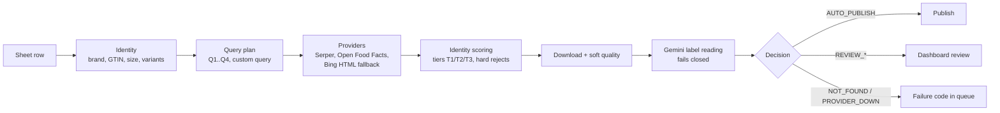

# Product Image Automation Pipeline

[](https://github.com/OsamaHamad123/product-image-automation-pipeline/actions/workflows/ci.yml)
[](https://github.com/OsamaHamad123/product-image-automation-pipeline/actions/workflows/codeql.yml)

This pipeline finds a product photo for each SKU in a UAE grocery catalogue kept in a Google Sheet. A person reviews the photo before it is published.

It reads SKUs from the sheet and searches for candidate images. Each candidate is scored on whether it shows the exact product: brand, size, variant and pack. The best candidates go to Gemini, which reads the label. The code then decides whether a candidate goes to a reviewer, is published automatically, or is reported as not found. An approved image becomes an 800×800 white packshot on Cloudinary, and its link is written back to the sheet. Staff review and correct results in a Laravel dashboard, and their corrections change later searches.

Anything the pipeline cannot prove goes to a person. Auto-publishing is **off** by default. It can only be turned on per brand, after a measured accuracy check (see [Evaluation](#evaluation)).

## How a search works

`image_search.search_best_product_image()` is the single entry point. Its signature has not changed. `SEARCH_ENGINE=v2` (the default) runs the `catalog_match/` decision core. `SEARCH_ENGINE=v1` runs the old code, kept only as a rollback for 30 days after v2 became the default.



1. **Identity** (`catalog_match/identity.py`, `brand_index.py`, `sizes.py`, `variants.py`, `gtin.py`). Each sheet row becomes a `SkuSpec`.
   - The brand is resolved through the *Brands Mapping* sheet, using synonyms, Arabic spellings and sub-brands. The result is `mapped`, `sheet_raw` or `none`. A brand is never guessed from the first word of the name.
   - The size, pack count and exclusive variants (fat, flavour, sugar and so on) are parsed from the size column and the names.
   - The barcode is checked as a GTIN.
   - `sku_key` is the GTIN-14 when the barcode is valid. Otherwise it is a hash of brand, name and size.
2. **Query plan.** At most 4 queries, all deterministic:
   - brand + product words + variant + size, in English;
   - the Arabic name, when there is one;
   - a query limited to UAE retailer sites;
   - `"brand" GTIN`.

   The bare barcode is never used as an image query. A staff custom query replaces the whole plan.
3. **Providers.**
   - Serper.dev Google Images (`gl=ae`) is the main source.
   - Open Food Facts is used when the GTIN is valid.
   - A Bing HTML scraper runs only when there is no Serper key or Serper is down. Its results can never be auto-published.
   - The old Google CSE adapter is used only if a key is already configured, and until 2026-12-31.

   Every provider call reports its health: `ok`, `empty`, `error`, `quota` or `blocked`.
4. **Identity scoring.** Candidates from every query go into one pool and are ranked once. There is no first-hit-wins and no "last resort" pick.
   - **Tiers.** T1 is a GTIN match, or brand + size + every variant on a trusted page. T2 is brand matched with no conflicts. T3 is no brand evidence and no conflicts.
   - **Hard rejects:** a competitor brand, a size conflict, a pack conflict, a variant conflict, a different GTIN, a stock-photo domain, or an image a reviewer rejected (by URL or pHash).
5. **Download and soft quality.** The only hard image gates are:
   - download or decode failure;
   - short side under 250 px;
   - an extreme aspect ratio;
   - an empty or full foreground;
   - noise.

   A white background is the target, not a defect. Exposure, blur and contrast only break ties.
6. **Verification.** One Gemini call compares the top 4 downloaded candidates at 1024 px, with at most 2 calls per SKU. Gemini returns what it reads: brand, variant, size, pack count and view. The code decides MATCH, MISMATCH or UNSURE, and re-parses the size it read.
   - A timeout, quota error, bad response or safety block becomes `UNKNOWN`, which is never accepted.
   - Five `UNKNOWN` results in a row open a circuit breaker.
   - The model is checked when the worker starts.
7. **Decision.** One of these:

   | Decision | Meaning |
   |:--|:--|
   | `AUTO_PUBLISH` | Every condition holds: auto-publish is on for this brand, the winner is T1, Gemini says MATCH, the source is sanctioned, the brand is `mapped`, the query was not relaxed, and it is not a cache hit. |
   | `REVIEW_PRESELECTED` | A reviewer sees the candidates, with the likely one already ticked. |
   | `REVIEW_UNSELECTED` | Candidates exist but none is confirmed. Nothing is ticked. |
   | `NOT_FOUND` | Providers were healthy but nothing survived. The failure code is `NO_RESULTS` or `ALL_CONFLICTED`. |
   | `PROVIDER_DOWN` / `VERIFIER_DOWN` | Retryable. These are never counted as product failures. |

The dashboard shows every candidate's `status`, `reasons` and `evidence`, and what Gemini read.

## Human review and corrections

- **Approve** (`cli_bridge.py select_image`).
  - Processes the chosen image, uploads it and writes the link to the sheet.
  - Stores the result in `resolved_products` as `human_approved`, keyed by `sku_key`. The barcode is required when the row has one.
  - Writes metadata to the sheet only after the upload succeeds.
- **Reject** (`cli_bridge.py reject_image`). Takes a reason code: `WRONG_PRODUCT`, `WRONG_BRAND`, `WRONG_VARIANT`, `WRONG_SIZE`, `WRONG_PACK`, `NOT_PACKSHOT` or `LOW_QUALITY`. The legacy cosmetic codes `HALO_ARTIFACT`, `BACKGROUND_BLEED` and `CROP_MARGIN_CLIPPING` are still accepted. A reject:
  - stores the URL and pHash in `rejected_images`, and every later search for that SKU excludes them;
  - marks the cached resolution `superseded`;
  - deletes that row's candidates;
  - blanks the sheet cell only if it still holds the rejected URL.

  With `research: true` it runs the search again straight away, with the exclusions applied.
- **Cache.** The cache only serves `human_approved` or `auto_verified` resolutions. When the row has a barcode, the lookup uses the barcode only; it never falls back to the name. Older cache rows are marked `legacy` and are not served.

## Publishing

`image_processor.process_product_image_result()` returns `ProcessResult(path, isolated, provider, error, width, height)`. The published file is a square PNG with the product filling 88% of it (`OUTPUT_PRODUCT_FILL`). Its side follows the product's own pixels: round(product long side / 0.88), at least `OUTPUT_CANVAS_SIZE` (800 by default, the Settings page's size) and at most `OUTPUT_CANVAS_MAX` (2048 by default; set it to the minimum for a fixed canvas). A small source gets exactly the 800 px canvas it got before; a detailed one keeps its detail for a 3x phone screen (~1170 px wide). The quality gate still judges the cutout at the minimum size, so its flags do not change. The image is turned upright from its EXIF data and is never cropped square or upscaled.

If background removal fails, the result is `isolated=False`. The raw photo is never published as if it were clean: nothing is uploaded, the image cell keeps its previous value (the app reads that cell directly, so it only ever holds a clean link) and the row waits for review in the queue with its candidates. A cell that still holds an old `needs_review:<url>` value reads as a pending review; approving or rejecting it writes a clean link or empties it.

Cloudinary delivers the canvas with `c_limit,w_1200,f_webp,q_auto` only: WebP keeps the transparency for native app clients (with `f_auto` the Android, iOS and Dart HTTP clients were sent a JPEG without alpha, a white box in dark mode), and the width is capped at 1200 px. The opaque white version of the same asset is `b_white,c_limit,w_1200,f_jpg,q_auto`. Older `q_auto,f_auto` links keep working and count as the same image; `python scripts/migrate_delivery_urls.py` rewrites the ones already in the sheet (dry run by default, `--apply` queues the writes).

## Google Sheets

- **Column matching.** Columns are found by header name, using a synonym table. For example, `EAN`, `GTIN`, `UPC` and `الباركود` all mean barcode, and `Item Name` and `اسم المنتج` mean name. A sheet with no name column fails with an error that lists the headers it found. There is no fallback to fixed column positions.
- **Missing tab.** If the configured tab (`SPREADSHEET_TAB_NAME`) does not exist, the run fails. It no longer writes into the first tab.
- **Outbox.** Every write goes through a MariaDB outbox (`sheet_updates`) together with the product's identity.
  - At flush time the target column is found by its header name, and the barcode or name in the target row is read again.
  - A mismatch is recorded as `CONFLICT` and nothing is written.
  - Updates to the same cell are collapsed so the newest wins.
  - If a batch fails, the rows are retried one at a time, so one bad row does not block the rest.
  - A row that fails 5 times becomes `DEAD`.
- **Redis write-behind** (`sync_worker.py`) is optional. It is used only while the worker keeps its `writebehind:heartbeat` key alive. Keys are removed only after a successful write, and payloads it does not recognise are left in place.

## What runs

| Part | Entry point | Role |
|:--|:--|:--|
| Dashboard | `dashboard/` (Laravel 11) | Review, approve, reject and upload. Calls `cli_bridge.py` directly. |
| CLI bridge | `cli_bridge.py <action> <base64 json>` | `search`, `select_image`, `reject_image`, `upload_manual_image`, `get_products`, `sheet-preview`, `sheet-save`. It prints one JSON document to stdout; logs go to `temp/search.log`. |
| Queue | `main.py --enqueue`, then `main.py --worker` | Enqueue is an upsert. It keeps rows that are in review or completed, and stores the full row (Arabic name and brand, category, size) plus `sku_key`. The worker claims tasks atomically with a 15-minute lease, and retries only when providers are down or an exception is raised. |
| Sync worker (optional) | `sync_worker.py` | Redis write-behind, started only when Redis runs. |
| Development API | `fastapi_server.py` | A thin wrapper over the same `cli_bridge` functions. No launcher starts it. |

There are no Celery workers, no Google Drive upload and no local vision models (CLIP, SigLIP, BLIP, DINOv2). The `verification_layer/` package has been removed.

## Evaluation

Changes to image choice are measured, not assumed.

- **Offline harness** (`pytest tests/eval`). Runs in CI with no network, keys or database.
  - 63 realistic UAE SKUs (370 candidates) are replayed through both engines. Candidate images are synthetic, and the vision-model answers come from a recorded cassette.
  - Metrics: auto-publish precision and wrong-auto rate, correct-pick rate, preselect precision, review rate, false NOT_FOUND rate, pool recall, and how often each rule rejected a correct image.
  - The v1 baseline (`tests/eval/fixtures/baseline_v1.json`) picks the right image for 39.7% of SKUs and auto-publishes a wrong one for 55.6%.
  - The v2 gate (`tests/eval/test_eval_v2_gate.py`) requires:
    - zero wrong auto-publishes;
    - auto-publish precision of at least 0.98;
    - correct-pick of at least 0.85, and at least v1 + 0.25;
    - no correct image rejected by a quality rule;
    - false NOT_FOUND of at most 5%;
    - no auto picks while Gemini is down;
    - at most 4 queries and 2 VLM calls per SKU.
- **Scorecard:** `python scripts/eval_report.py --engine v2` (or `--engine v1`, `--scenario gemini_down`).
- **Real golden set** (owner's machine, with keys):
  1. `python scripts/eval_record.py --rows 2-201` records providers, image blobs and Gemini verdicts. It never writes to the sheet.
  2. Staff fill the `label` column of the exported `labels.csv` with one of: `correct_exact`, `wrong_variant`, `wrong_size`, `wrong_pack`, `wrong_brand`, `wrong_product`, `not_packshot` or `unusable`.
  3. `--import-labels` brings the labels back in, and the set replays offline with `eval_report.py --golden ... --cassette ...`.
- **Live dry run** before switching the live sheet: `python scripts/smoke_live.py --rows 2-31 --dry-run`.

Auto-publish is turned on for a brand or category only when both hold:

- the real golden set shows ACCEPT precision of at least 98%, with a Wilson lower bound of at least 95%;
- two weeks of reviews show at most 2% wrong among the picks that would have been auto-published.

## Owner actions (not fixable in code)

1. **Rotate the leaked credentials.** The Google API key and the Cloudinary secret committed in `4ef704e` must be rotated now. Purging them from git history is optional, and only needed if the repository was ever shared.
2. **Create a Serper.dev account.** Put the key in `SERPER_API_KEY` or in the dashboard settings. Check the current price and terms when you buy. Without it, search falls back to the Bing HTML scraper, whose results always need review.
3. **Enable Gemini paid tier 1.** The free quota (about 500 requests a day) cannot sustain batch runs. The model name comes from `GEMINI_MODEL` (default `gemini-3.1-flash-lite`) and is checked at worker start.
4. **Clean up the *Brands Mapping* sheet.** Its columns are `Brand`, `Synonyms`, `Excluded Competitors`, `Sub-brands` and `Official domains`.
   - Add Arabic spellings to `Synonyms` (for example `المراعي`).
   - Put parent-brand families in `Sub-brands` (for example Nestle → `Nido, KitKat, Maggi`).
   - Put the brand's own sites in `Official domains`.

   Only a `mapped` brand can ever be auto-published.
5. **Schedule 6–8 staff hours to label the golden set** (see [Evaluation](#evaluation)). Curation selections are never used as labels.

## Configuration

Secrets come from environment variables or `.env`, and the dashboard's `system_settings` table overrides them. Never commit `.env` or `credentials.json`.

| Variable | Purpose |
|:--|:--|
| `SEARCH_ENGINE` | `v2` (default) or `v1` (rollback) |
| `SERPER_API_KEY` | Main image search provider |
| `GEMINI_API_KEY`, `GEMINI_MODEL` | Label-reading verifier |
| `AUTO_PUBLISH_ENABLED`, `AUTO_PUBLISH_BRANDS` | Off and empty by default. Comma-separated brand allow-list. |
| `OUTPUT_CANVAS_SIZE` | Published canvas size (default 800) |
| `GOOGLE_SEARCH_API_KEY`, `GOOGLE_SEARCH_CX` | Old Google CSE. Used only if already configured, until 2026-12-31. |
| `SPREADSHEET_NAME_OR_URL`, `SPREADSHEET_TAB_NAME`, `CREDENTIALS_FILE` | Google Sheet and service account |
| `CLOUDINARY_*` | Image hosting |
| `BG_REMOVAL_METHOD`, `PHOTOROOM_API_KEY`, `REMOVE_BG_API_KEY` | Background removal |
| `FORCE_OVERWRITE_IMAGES` | Default `False`. When `True`, rows that already have a final link are searched again. |
| `DB_*` | MariaDB (queue, cache, curation, rejections, outbox) |
| `REDIS_*` | Optional write-behind |

## Getting started

- **Windows:** put `credentials.json` in the project root and run `setup_and_launch.bat`. See [`docs/walkthrough.md`](docs/walkthrough.md) (in Arabic).
- **Manually:**

```bash
python -m venv .venv && source .venv/bin/activate      # Windows: .venv\Scripts\activate
pip install -r requirements.txt
cp .env.example .env                                   # fill in the keys
python main.py --enqueue && python main.py --worker    # batch pre-search
cd dashboard && composer install && php artisan serve --port=8000
```

## Tests

```bash
pip install -r requirements-dev.txt
pytest                 # everything that runs offline, including tests/eval
```

The tests never use the network or API keys; live-provider tests carry the `network` marker and are deselected. Tests run against the MariaDB database `automation_test`, never `automation_db`. The real-database tests in `tests/test_automation_flow.py` skip when MariaDB is unreachable. CI runs the suite against a MariaDB service container.

## Known limits

- The dashboard has no login and must stay on localhost.
- A dashboard search blocks the single-threaded PHP server while it runs. The per-SKU caps bound how long.
- The v1 search code and `aesthetics_engine` are kept only for the rollback. They are deleted 30 days after v2 becomes the default.
