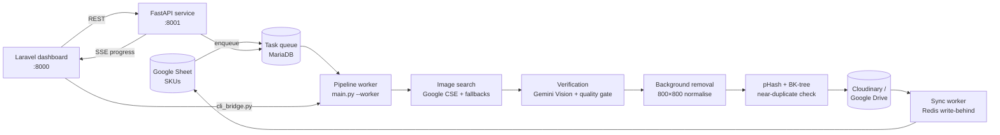

# Product Image Automation Pipeline

Finds, verifies and publishes a clean product photo for every SKU in a grocery e-commerce catalogue.

Data-entry staff used to search for each product image by hand, then clean it up and upload it. This pipeline does that work. It reads SKUs from a Google Sheet and finds candidate images. It checks the candidates with Gemini Vision, removes the background, normalises the result to 800×800 on white and drops duplicates. It then uploads the image to Cloudinary or Google Drive and writes the link back to the sheet. A Laravel dashboard lets staff review the picks and override them.

## Architecture



The system runs as separate services:

| Service | Entry point | Role |
|:--|:--|:--|
| **FastAPI service** | `fastapi_server.py` (port 8001) | REST API for search, selection, manual uploads and batch status, plus a server-sent-events stream of live progress |
| **Pipeline worker** | `main.py --enqueue` / `main.py --worker` | Queues SKUs from the sheet, then processes them one by one |
| **Celery workers** | `celery_config.py` | Separate queues for crawling (I/O), enhancement and embeddings (GPU) and de-duplication (CPU), so each workload scales on its own |
| **Sync worker** | `sync_worker.py` | Collects sheet updates in Redis and writes them back in batches, retrying on Google API rate limits (HTTP 429) |
| **Dashboard** | `dashboard/` (Laravel 11, port 8000) | Where staff review, approve or reject images and upload their own |

## Highlights

- **Near-duplicate detection.** DCT-based perceptual hashing, indexed in a BK-tree so lookups stay fast as the catalogue grows (`image_dedup_bktree.py`).
- **Hybrid search.** Several image sources are merged with Reciprocal Rank Fusion (`verification_layer/`).
- **SSRF-safe image proxy.** The proxy that fetches remote images refuses internal-network addresses (`verification_layer/use_cases/image_proxy_service.py`).
- **Layered verification module.** `verification_layer/` is split into domain, use-case, infrastructure and presentation layers.
- **Distributed GPU lock.** A Redis-based lock falls back to a local lock when Redis is unavailable (`distributed_lock.py`).
- **Pluggable background removal.** `BG_REMOVAL_METHOD` picks PhotoRoom or remove.bg in the cloud, or rembg / Bria RMBG locally (these need extra packages).

## Tech stack

`Python` `FastAPI` `Celery` `Redis` `Google Gemini` `OpenCV` `NumPy/SciPy` `gspread` `Google Drive API` `Cloudinary` `MariaDB` `Laravel 11` `PHP 8.2`

## Getting started

### Windows (one click)

1. Put your Google service-account key in the project root as `credentials.json`.
2. Double-click `setup_and_launch.bat`. On the first run it creates the Python virtualenv, downloads a portable PHP and Composer, installs dependencies and generates `.env`.
3. Fill in your API keys in `.env` (see `.env.example`), then run `setup_and_launch.bat` again. The dashboard opens in the browser.

See [`docs/walkthrough.md`](docs/walkthrough.md) for the full setup guide (in Arabic).

### Manual

```bash
python -m venv .venv
source .venv/bin/activate          # Windows: .venv\Scripts\activate
pip install -r requirements.txt
cp .env.example .env               # then fill in your keys

uvicorn fastapi_server:app --port 8001   # API
python main.py --enqueue                 # queue SKUs from the sheet
python main.py --worker                  # process the queue
python sync_worker.py                    # write results back to the sheet

cd dashboard && composer install && php artisan serve --port=8000
```

## Configuration

All secrets come from environment variables. The full list is in [`.env.example`](.env.example). Never commit `.env` or `credentials.json`, which are already git-ignored.

| Variable | Purpose |
|:--|:--|
| `GOOGLE_SEARCH_API_KEY`, `GOOGLE_SEARCH_CX` | Google Custom Search (comma-separate several keys to rotate between them) |
| `GEMINI_API_KEY` | Gemini Vision verification |
| `CLOUDINARY_*` | Image hosting |
| `DRIVE_FOLDER_ID` | Optional Google Drive upload folder |
| `BG_REMOVAL_METHOD`, `PHOTOROOM_API_KEY`, `REMOVE_BG_API_KEY` | Background-removal provider |
| `TELEGRAM_BOT_TOKEN`, `TELEGRAM_CHAT_ID` | Optional admin alerts |
| `DB_*` | MariaDB connection for the task queue and cache |

## Project layout

```text
├── main.py, fastapi_server.py, sync_worker.py, cli_bridge.py   # service entry points
├── image_search.py, image_processor.py, image_dedup_bktree.py  # pipeline stages
├── google_sheets.py, google_drive.py, cloudinary_storage.py    # integrations
├── verification_layer/     # layered verification module
├── dashboard/              # Laravel curation dashboard
├── scripts/                # diagnostics and the legacy SQLite → MariaDB migration
├── tests/                  # pytest suite
├── docs/                   # setup walkthrough
└── setup_and_launch.bat    # Windows one-click installer and launcher
```

## Tests

```bash
pip install pytest
pytest tests
```

Some tests call live services (image search, Google APIs, Redis) and are skipped or fail when those services can't be reached.
